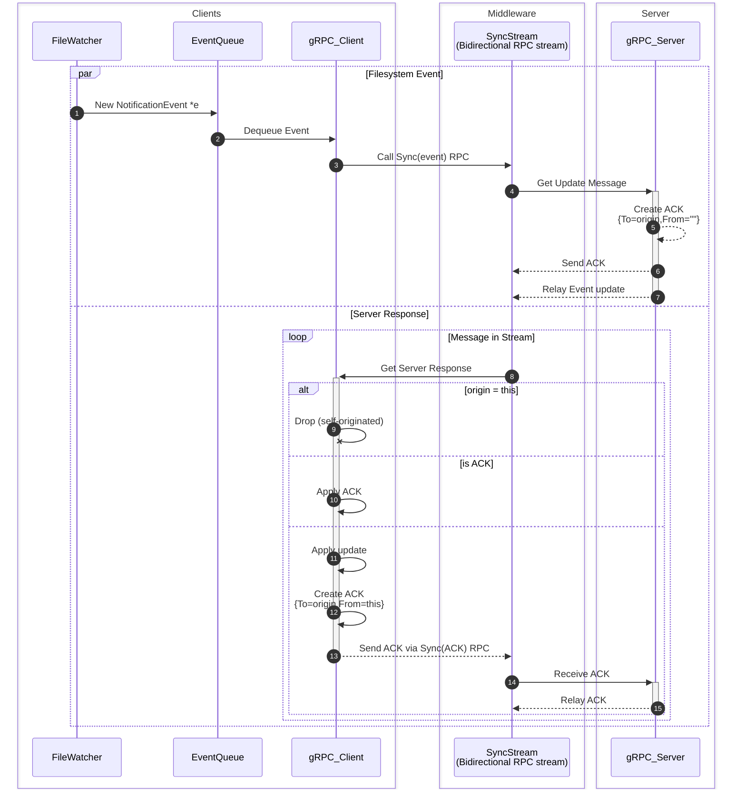

```mermaid
sequenceDiagram
    box Clients
    participant FW as FileWatcher
    participant Q1 as EventQueue
    participant RC as gRPC_Client
    end

    box Middleware
    participant S as SyncStream<br/>(Bidirectional RPC stream)
    end

    box Server
    participant RS as gRPC_Server
    end

    autonumber
    par Filesystem Event
        FW->>Q1: New NotificationEvent *e
        Q1->>RC: Dequeue Event
        RC->>S: Call Sync(event) RPC
        S->>+RS: Get Update Message
        RS-->>RS: Create ACK<br/>{To=origin,From=""}
        RS-->>S: Send ACK
        RS-->>-S: Relay Event update
    and Server Response
        loop Message in Stream
            S->>+RC: Get Server Response
            alt origin = this
                RC-xRC: Drop (self-originated)
            else is ACK
                RC->>RC: Apply ACK
            else
                RC->>RC: Apply update
                RC->>RC: Create ACK<br/>{To=origin,From=this}
                RC-->>-S: Send ACK via Sync(ACK) RPC
                S->>+RS: Receive ACK
                RS-->>-S: Relay ACK
            end
        end
    end
```