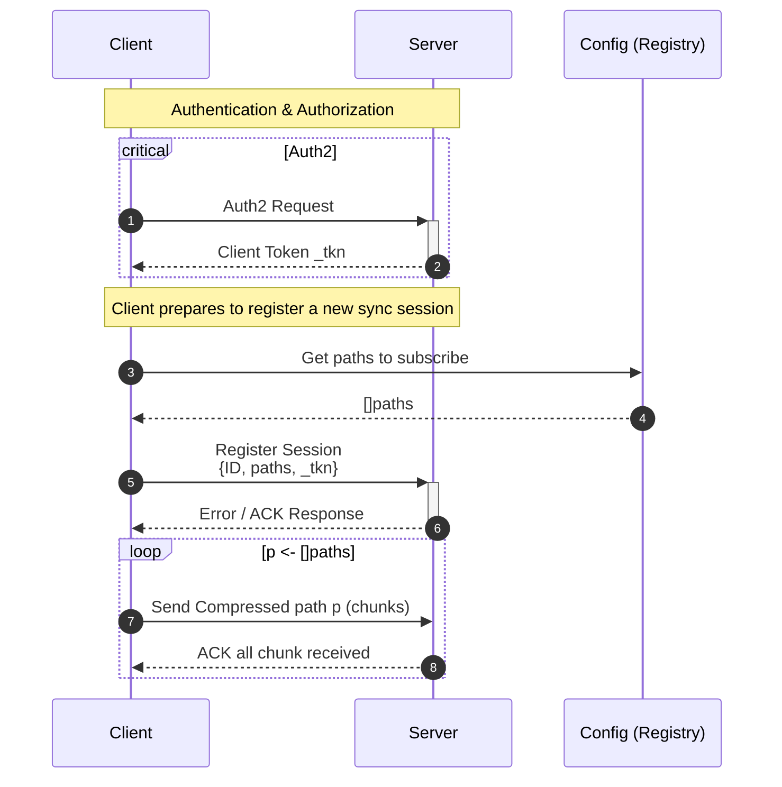

```mermaid
sequenceDiagram
    %% High level connection initialization diagram
    participant Client
    participant Server
    participant Config as Config (Registry)


    %% Skipping authentication and authorization
    autonumber
    Note over Client,Server: Authentication & Authorization
    critical Auth2
        Client ->>+ Server: Auth2 Request
        Server -->>- Client: Client Token _tkn
    end

    %% Session registration: First the client tries to register
    %% a new session sending the list of paths, its client ID and 
    %% the authorization token received on authentication.
    %% If the registration is successful then, for each path, 
    %% compress its content and sends it to the server. Server-side
    %% additional checks on path is NYD.
    Note over Client,Server: Client prepares to register a new sync session
    Client ->> Config: Get paths to subscribe
    Config -->> Client: []paths
    Client ->>+ Server: Register Session<br/>{ID, paths, _tkn}
    Server -->>- Client: Error / ACK Response

    loop p <- []paths
        Client ->> Server: Send Compressed path p (chunks)
        Server -->> Client: ACK all chunk received
    end
```